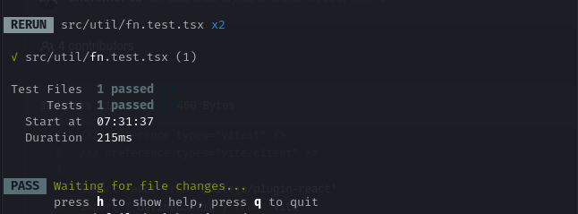

# Setup vite2 with testing-library/react & Jest for testing

One of the selling point of the Vite build tool is that it is a blazingly fast JS build tool for developing web applications using modern front-end frameworks like Reactjs, Vuejs, Svelte etc. Over the last 2 years, we have seen an increasing growth in the use of Vite in the JS developer community. Its a great tool.

I heard about Vite when I was working as a Vue/Nuxt developer in 2020. As someone whom I hold in much respect, [Evan You's](https://evanyou.me/) tweet about Vite was all I needed to see to know just how relevant Vite was.

Vite is a great JS build tool and its blazing fast. Although I haven't used it for very long, so far, I am already excited about its performance and the many functionalities it offers. It has a very simple and easy to understand API interface.

In this tutorial I will teach you how to set up your Vite project for testing react app using ``Jest``, ``testing-library/react`` & ``vitest`` library. The steps are as follows

## Scaffold new project

Use this [link](https://vitejs.dev/guide/#scaffolding-your-first-vite-project) to find out how to scaffold a new react project using the Vite build tool, and run the development server.

## Install dependencies

After installing all the necessary packages and you confirm that the development server is running, install the following additional dependencies:

```powershell
yarn add jest @types/jest @testing-library/jest-dom @testing-library/react @testing-library/user-event @vitest/ui jsdom@latest vitest@latest -D
```
> _Vitest is a blazing fast unit test framework powered by Vite. [Find out more](https://vitest.dev/guide/)_

## Update your ``package.json`` script

Open your ``package.json`` file, which is at the root of your project. Add the following entries to the ``scripts`` object:

```json
// File: package.json

"scripts": {
	// other entries
	"test": "vitest",
	"coverage": "vitest run --coverage"
},

```

## Setup test

Create a new folder and call it ``test``, in the ``src`` folder of your project. Inside the test folder add a new file and call it ``setup.ts``. Inside this file add the following:

```ts
// File: src/test/setup.ts

import "@testing-library/react"
```

## Add ``vitest`` configurations

Create a new file, ``vitest.config.ts`` at the root of your project. Add the following content

```ts
// File: vitest.config.ts

import { configDefaults, defineConfig } from "vitest/config";

export default defineConfig({
	test: {
		...configDefaults,
		environment: "jsdom",
		globals: true,
		setupFiles: "./src/test/setup.ts",
	// you might want to disable it, if you don't have tests that rely on CSS
	// since parsing CSS is slow
		css: false,
	},
});
```
## Add test files

Now you can create a file with the suffix ``.test.tsx`` or ``.test.ts`` anywhere within your project directory. In these files, you will write your test. For example: I will create a file ``fn.ts`` to hold simple utility helper functions I can use within my project. I will create a function to convert an object to URLSearchParam. It is as follows:

```ts
// File: src/util/fn.ts

export function objectToSearchParam(
	obj: string | string[][] | Record<string, string>
) {
	return new URLSearchParams(obj);
}
```
Then, I create a file, ``fn.test.ts``, to test the ``fn`` file, in the same directory, and added the following:

```ts
// File: src/util/fn.test.ts

/**
 * @jest-environment jsdom
 */

import { objectToSearchParam } from "./fn";

describe("Util functions", () => {
	it("converts object to url search parameter", () => {
		const searchParam = objectToSearchParam({
			key: "value",
			key2: "value2",
		});
		expect(searchParam).toBe(`?key=value&key2=value2`);
	});
});
```
> The above is a very simple test case. You can write more complicated test cases that can interact with react components and dom events if you like. This is for demonstration purpose only.

## Run tests

To run your test, use the following shell commands

```powershell
yarn test
```
After running the test command, I get the following:


Was this helpful? Leave a comment and thumbs up!
